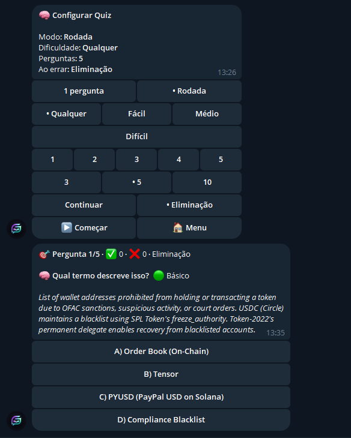
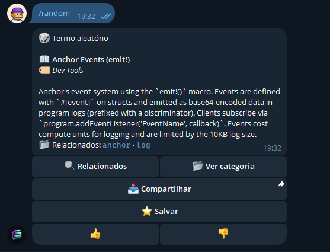
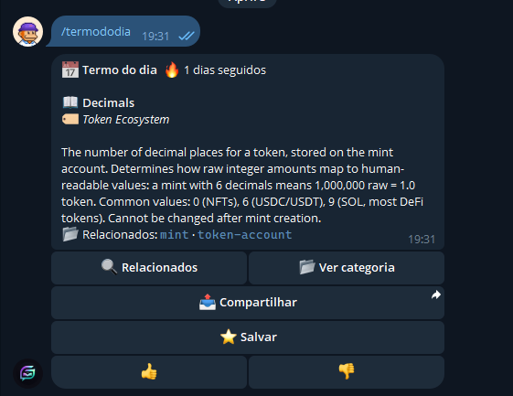

# Solana Glossary Bot

A Telegram-native learning and onboarding bot for Solana communities.

Instead of sending people to static docs or glossary pages, the bot explains terms inside Telegram, supports direct lookup in DMs, guides users through curated learning paths, and reinforces recall with quizzes, streaks, favorites, history, and daily discovery.

## Summary

- Built for Solana communities that already onboard and answer questions inside Telegram
- Powered by the Solana Glossary dataset and localized glossary content
- Supports English, Portuguese, and Spanish
- Combines reference lookup, guided learning, and retention loops in one product
- Live bot: `https://t.me/SolanaGlossaryBot`
- Health endpoint: `https://solana-glossary-production.up.railway.app/`

## Why It Matters

Solana communities already live in Telegram, but onboarding still breaks the conversation:

- newcomers hit unfamiliar terms in live chats and leave to search elsewhere
- community members repeat the same explanations over and over
- static glossaries work as references, but not as in-context learning tools

This bot keeps the learning loop where the conversation already happens:

- explain terms from replied messages in group chats
- search terms directly in DMs
- browse categories and related concepts without leaving Telegram
- turn passive reading into retention with paths, quizzes, streaks, and daily discovery

## What Makes This Different

- Telegram-native onboarding: built around reply-to-explain and in-chat discovery instead of a detached website
- Guided learning: `/path` turns the glossary into structured learning flows, not just a search box
- Retention loops: `/quiz`, `/termofday`, favorites, history, streaks, and leaderboard mechanics create repeat usage
- Multilingual by default: English, Portuguese, and Spanish reduce onboarding friction for LATAM and global communities
- Contextual enrichment: selected terms include live network or market context when relevant

## Live Demo

- Bot: `https://t.me/SolanaGlossaryBot`
- Health endpoint: `https://solana-glossary-production.up.railway.app/`

Try these flows in under 2 minutes:

1. In a group chat, reply to a message containing Solana terms with `/explain`
2. In a DM with the bot, send a term like `pda` or `proof of history`
3. Run `/path` for guided learning or `/quiz` for active recall

## What It Does Today

- Explain Solana terms from replied messages with `/explain` or `/explicar`
- Search directly with `/glossary`, `/glossario`, or `/glosario`
- Accept free-text glossary search in DMs
- Compare two concepts side by side with `/compare` or `/comparar`
- Browse categories and category pages with inline navigation
- Explore guided learning paths with saved progress
- Run quizzes with streak and leaderboard loops
- Save favorites and revisit recent history
- Use inline mode in any Telegram chat
- Show live network context for selected protocol terms
- Show live SOL price context for selected DeFi terms

## Quick Start

Requirements:

- Node.js 22+
- Telegram bot token from BotFather

Local development:

```bash
cd apps/telegram-bot
# macOS / Linux
cp .env.example .env

# Windows
copy .env.example .env

npm install
npm run dev
```

Set `BOT_TOKEN` in `apps/telegram-bot/.env` before starting the bot.

For local development, leave `WEBHOOK_DOMAIN` empty and the bot will use long polling.

Useful commands:

```bash
npm run build
npm test
```

## Commands

### Core Commands

| Command | Aliases | Description | Example |
|---|---|---|---|
| `/start` | - | Start the bot and onboarding flow | `/start` |
| `/help` | - | Show help and navigation tips | `/help` |
| `/language` | `/idioma` | Change bot language | `/language pt` |
| `/glossary` | `/glossario`, `/glosario` | Look up a term directly | `/glossary pda` |
| `/explain` | `/explicar` | Explain terms from a replied message or inline input | reply with `/explain` |
| `/compare` | `/comparar` | Compare two Solana concepts side by side | `/compare pda vs account` |

### Learning and Discovery

| Command | Aliases | Description | Example |
|---|---|---|---|
| `/path` | `/trilha` | Open guided learning paths | `/path` |
| `/categories` | `/categorias` | Browse all glossary categories | `/categories` |
| `/category` | `/categoria` | List terms from one category | `/category defi` |
| `/termofday` | `/termododia`, `/terminodelhoy` | Show the daily term | `/termofday` |
| `/random` | `/aleatorio` | Show a random term | `/random` |
| `/quiz` | - | Start an interactive quiz | `/quiz` |

### Personal Progress

| Command | Aliases | Description | Example |
|---|---|---|---|
| `/favorites` | `/favoritos` | Show saved terms | `/favorites` |
| `/history` | `/historico`, `/historial` | Show recently viewed terms | `/history` |
| `/streak` | `/sequencia` | Show your quiz streak | `/streak` |
| `/leaderboard` | `/ranking` | Show global or group ranking | `/leaderboard` |
| `/rank` | `/posicao` | Show your current rank position | `/rank` |

### Usage Notes

- `/explain` works best as a reply in group chats. It can also accept inline text input.
- `/glossary` accepts a term or phrase and returns the best glossary match.
- `/compare` expects two concepts separated by `vs`, `x`, comma, or pipe.
- `/category` expects a category id such as `defi`, `core-protocol`, or `security`.
- Free-text DMs also work as direct glossary lookup without needing `/glossary`.

## Core Flows

### Reply-to-Explain

1. Someone mentions a Solana concept in a group chat.
2. Another user replies with `/explain`.
3. The bot detects up to 3 glossary terms in the replied message.
4. It returns glossary cards with related navigation and live context when relevant.

### Learning Paths

`/path` opens guided learning tracks instead of a flat category dump:

- Solana Basics
- DeFi Foundations
- Builder's Path

Each path saves the user's current step and can be resumed later.

### Daily Learning

- `/termofday` creates a lightweight daily learning habit
- `/quiz` turns recall into an active loop
- streaks and leaderboard add gentle social motivation

## Repository Structure

This repository contains both the glossary data/package and the Telegram bot implementation.

- Root package: `@stbr/solana-glossary`
- Telegram bot app: `apps/telegram-bot`
- Source glossary data: `data/terms/*.json`
- Bot-vendored glossary data: `apps/telegram-bot/src/glossary/data/terms/*.json`
- Localized glossary term files: `data/i18n/*.json` and `apps/telegram-bot/src/glossary/data/i18n/*.json`
- Bot UI locale files: `apps/telegram-bot/src/i18n/locales/*.ftl`

## Architecture

High-level flow:

1. Telegram sends updates to the bot
2. `grammY` routes commands, callbacks, inline queries, and DM text
3. glossary search and lookup resolve terms from the vendored dataset
4. enriched term cards optionally add live Solana network or price context
5. SQLite stores user progress and engagement state
6. the app runs in long polling locally and webhook mode in production

Stack:

- TypeScript
- Node.js
- grammY
- @grammyjs/i18n
- Express
- better-sqlite3
- SQLite
- Railway

## SDK and Data Integration

The bot is powered by the Solana Glossary dataset vendored into the Telegram app for reliable deployment.

Primary data sources:

- `data/terms/*.json`
- `apps/telegram-bot/src/glossary/data/terms/*.json`
- `apps/telegram-bot/src/glossary/index.ts`

Localized glossary content is served from:

- `apps/telegram-bot/src/glossary/data/i18n/pt.json`
- `apps/telegram-bot/src/glossary/data/i18n/es.json`

This keeps the Telegram experience tightly coupled to the glossary data layer while remaining deployable as a standalone app.

## Persistence

The bot stores engagement and learning state in SQLite, including:

- user language preference
- favorites
- recent history
- daily term streaks
- quiz sessions and progress
- learning path progress
- leaderboard-related user state
- group participation and group streak tracking

By default, the SQLite database is stored under the bot app data directory.

## Environment Variables

Reference env file:

- `apps/telegram-bot/.env.example`

| Variable | Required | Description | Example |
|---|---|---|---|
| `BOT_TOKEN` | Yes | Telegram bot token from BotFather | `123456789:ABC...` |
| `WEBHOOK_DOMAIN` | No in local dev, yes in production | Public base URL used for webhook mode | `https://your-app.up.railway.app` |
| `PORT` | No | Server port, defaults to `3000` locally | `3000` |

Runtime behavior:

- If `WEBHOOK_DOMAIN` is empty, the bot starts in long polling mode
- If `WEBHOOK_DOMAIN` is set, the app starts an Express server and registers the Telegram webhook at `/webhook`
- The healthcheck endpoint responds at `/`

## Deployment

Recommended Railway setup:

- Root Directory: `apps/telegram-bot`
- Build Command: `npm install && npm run build`
- Start Command: `node dist/server.js`
- Healthcheck Path: `/`

Required production environment variables:

```env
BOT_TOKEN=your_telegram_bot_token
WEBHOOK_DOMAIN=https://your-service.up.railway.app
```

## Screenshots

Current screenshots cover onboarding, search, categories, quiz, favorites, random discovery, related terms, daily term, and streak/leaderboard.

Still worth adding for full command coverage:

- `/explain` in a real group reply flow
- `/compare` with two concepts side by side
- `/path` or `/trilha` showing learning path progress
- `/history` or `/historico`
- `/category` or `/categoria` with a category-specific listing
### Onboarding


### Search


### Categories


### Quiz



### Favorites


### Random



### Related


### Term of the Day



### Streak and Leaderboard


## Contributing

See `CONTRIBUTING.md` for glossary data contribution rules, validation steps, and category conventions.

## Repository

- GitHub: `https://github.com/lrafasouza/solana-glossary`
- Bot: `https://t.me/SolanaGlossaryBot`
