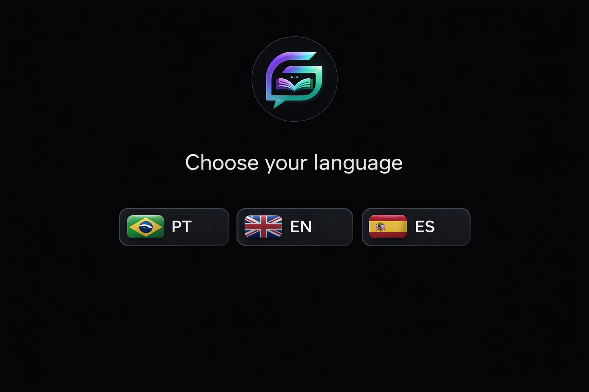

# Solana Glossary Telegram Bot

A multilingual Telegram bot that turns the Solana Glossary into a fast, conversational learning tool.

It helps users discover terms, browse categories, learn with a daily term, test themselves with quiz mode, save favorites, review history, and track streaks, all inside Telegram.

## Why this project exists

Most glossary experiences are passive: users visit a page, search once, and leave.

This bot makes the glossary usable in a more natural daily workflow:

- quick search inside Telegram
- guided exploration by category
- repeat learning through daily prompts and quizzes
- multilingual access for `pt`, `en`, and `es`
- retention mechanics like favorites, history, streaks, and leaderboard

The goal is simple: make Solana terminology easier to learn, revisit, and share.

## Live Demo

- Railway health endpoint: `https://solana-glossary-production.up.railway.app/`
- Deployment target: Railway
- Runtime mode: Telegram webhook

## Features

- Multilingual UX in Portuguese, English, and Spanish
- `/glossary`, `/glossario`, `/glosario` search commands
- Free-text lookup in DMs
- Inline mode for term search from any chat
- Category browser across all glossary categories
- Daily term with streak progression
- Quiz mode with retry flow and answer reveal
- Favorites and recent history
- Global leaderboard and personal rank
- Telegram command menus registered per language
- Webhook deployment for production and long polling for local development

## Glossary SDK / Data Integration

This project is powered by the official Solana Glossary data layer.

Source of truth:

- official glossary term data from `data/terms/*.json`
- localized glossary content derived from the glossary i18n data

For deployment portability, this bot vendors a deployable snapshot of the glossary data inside:

- [src/glossary/index.ts](/C:/Users/rafin/solana-glossary/apps/telegram-bot/src/glossary/index.ts)
- [src/glossary/types.ts](/C:/Users/rafin/solana-glossary/apps/telegram-bot/src/glossary/types.ts)
- [src/glossary/data](/C:/Users/rafin/solana-glossary/apps/telegram-bot/src/glossary/data)

That keeps the Railway deployment standalone while still using the official glossary dataset rather than a custom rewritten knowledge base.

## User Flows

### 1. Search and Learn

- User sends `/glossary proof-of-history`
- Bot returns a formatted term card
- User can jump to related terms from inline buttons

### 2. Browse by Category

- User opens `/categories`
- Bot shows all glossary categories
- User drills into paginated term lists

### 3. Daily Learning Loop

- User opens `/termofday`
- Bot returns the daily term
- User builds a streak by coming back regularly

### 4. Quiz and Retention

- User runs `/quiz`
- Bot shows a multiple-choice definition prompt
- Correct answers advance streaks and leaderboard position

### 5. Personal Knowledge Tracking

- User saves terms to favorites
- User checks recent lookup history
- User sees their streak and ranking progress

## Command Reference

### English

- `/start`
- `/glossary <term>`
- `/random`
- `/categories`
- `/termofday`
- `/quiz`
- `/favorites`
- `/history`
- `/streak`
- `/leaderboard`
- `/rank`
- `/language pt|en|es`
- `/help`

### Portuguese

- `/start`
- `/glossario <termo>`
- `/aleatorio`
- `/categorias`
- `/termododia`
- `/quiz`
- `/favoritos`
- `/historico`
- `/streak`
- `/leaderboard`
- `/posicao`
- `/idioma pt|en|es`
- `/help`

### Spanish

- `/start`
- `/glosario <termino>`
- `/aleatorio`
- `/categorias`
- `/terminodelhoy`
- `/quiz`
- `/favoritos`
- `/historial`
- `/streak`
- `/leaderboard`
- `/idioma pt|en|es`
- `/help`

## Screenshots / Assets

Current bot assets live in:

- [assets/chooselangugage.png](/C:/Users/rafin/solana-glossary/apps/telegram-bot/assets/chooselangugage.png)

```md

```


If you are preparing the final campaign submission, add Telegram conversation screenshots for:

- onboarding
- glossary lookup
- category browser
- quiz mode
- leaderboard

## Tech Stack

- TypeScript
- Node.js
- grammY
- @grammyjs/i18n
- Express
- better-sqlite3
- node-cron
- Railway

## Project Structure

```text
apps/telegram-bot/
├─ src/
│  ├─ bot.ts
│  ├─ server.ts
│  ├─ commands/
│  ├─ handlers/
│  ├─ i18n/
│  ├─ glossary/
│  ├─ db/
│  ├─ scheduler/
│  └─ utils/
├─ tests/
├─ assets/
├─ package.json
├─ package-lock.json
├─ railpack.toml
└─ nixpacks.toml
```

## Local Development

### Requirements

- Node.js 22+
- a Telegram bot token from `@BotFather`

### Environment

Use [`.env.example`](/C:/Users/rafin/solana-glossary/apps/telegram-bot/.env.example) as reference:

```env
BOT_TOKEN=your_bot_token
WEBHOOK_DOMAIN=
PORT=3000
```

For local development, leave `WEBHOOK_DOMAIN` empty. The bot will use long polling.

### Install

```bash
npm install
```

### Run in development

```bash
npm run dev
```

### Build

```bash
npm run build
```

### Start production build locally

```bash
npm start
```

### Tests

```bash
npm test
```

## Railway Deployment

Recommended Railway service configuration:

- Root Directory: `apps/telegram-bot`
- Builder: `Railpack`
- Build Command: `npm install && npm run build`
- Start Command: `node dist/server.js`
- Public Port: `8080`
- Healthcheck Path: `/`

Required environment variables:

```env
BOT_TOKEN=your_telegram_bot_token
WEBHOOK_DOMAIN=https://your-service.up.railway.app
```

Notes:

- Do not append `/webhook` to `WEBHOOK_DOMAIN`
- Railway provides `PORT` automatically
- The app sets the Telegram webhook to `${WEBHOOK_DOMAIN}/webhook`

## Data, Persistence, and Production Notes

The bot currently stores user state in SQLite:

- favorites
- history
- quiz sessions
- streaks
- scheduled notifications

The database file defaults to:

- `data/bot.db` locally

And can be overridden with:

```env
BOT_DB_PATH=/app/data/bot.db
```

Important production note:

- Railway containers are ephemeral by default
- without a persistent volume or external database, user progress can be lost on restart or redeploy

For a more durable production setup, mount persistent storage or migrate state to Postgres.

## Architecture Notes

- [src/server.ts](/C:/Users/rafin/solana-glossary/apps/telegram-bot/src/server.ts) starts the webhook server in production and long polling locally
- [src/bot.ts](/C:/Users/rafin/solana-glossary/apps/telegram-bot/src/bot.ts) wires middleware, commands, callbacks, inline mode, and text handlers
- [src/glossary/index.ts](/C:/Users/rafin/solana-glossary/apps/telegram-bot/src/glossary/index.ts) provides the glossary lookup layer
- [src/db/index.ts](/C:/Users/rafin/solana-glossary/apps/telegram-bot/src/db/index.ts) manages SQLite persistence
- [src/scheduler/notifications.ts](/C:/Users/rafin/solana-glossary/apps/telegram-bot/src/scheduler/notifications.ts) runs reminder jobs

## Internationalization

The bot supports:

- Portuguese
- English
- Spanish

Locale files live in:

- [src/i18n/locales/en.ftl](/C:/Users/rafin/solana-glossary/apps/telegram-bot/src/i18n/locales/en.ftl)
- [src/i18n/locales/pt.ftl](/C:/Users/rafin/solana-glossary/apps/telegram-bot/src/i18n/locales/pt.ftl)
- [src/i18n/locales/es.ftl](/C:/Users/rafin/solana-glossary/apps/telegram-bot/src/i18n/locales/es.ftl)

This directly supports one of the campaign bonus factors: strong i18n support.

## Submission Positioning

This project is designed to score well on the judging criteria:

- Usefulness: a real developer learning tool inside Telegram
- Quality: deployed webhook bot, multilingual UX, structured command set
- Creativity: glossary turned into a conversational retention product, not just a wrapper
- SDK/Data integration: grounded in the official glossary data layer
- Documentation: setup, architecture, deployment, and demo notes included here

## Known Limitations

- SQLite persistence is not durable on Railway without extra storage
- Two automated tests are currently out of sync with runtime behavior and should be updated
- Some user-facing strings still need encoding cleanup in a few source files
- The current live endpoint is a health/API surface, not a browser UI

## Next Improvements

- Add persistent database storage
- Fix the remaining failing tests
- Add richer onboarding visuals and screenshots
- Add telemetry or usage analytics
- Improve notification scheduling with timezone-aware logic
- Add a short demo video for the campaign submission

## License / Attribution

This bot builds on the Solana Glossary dataset and localized content from the parent project repository.
